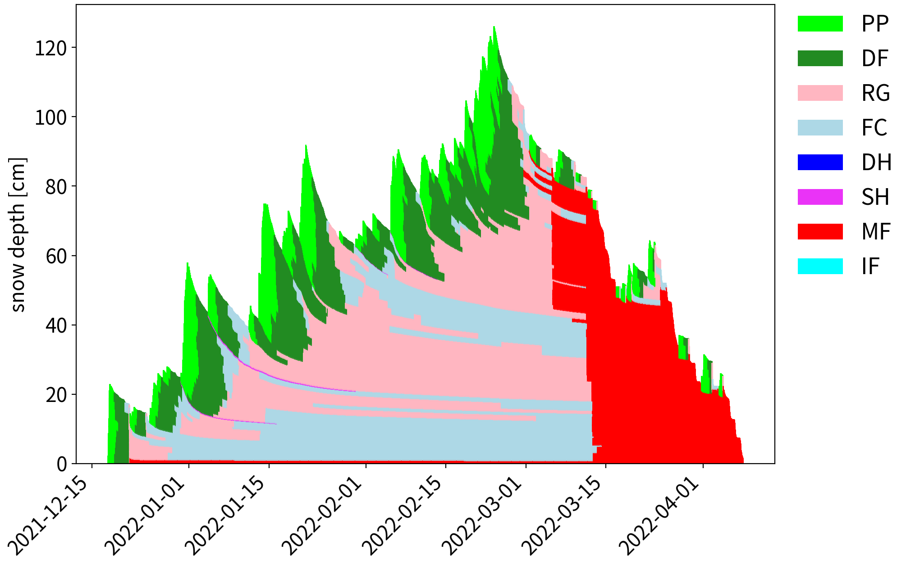

# snowpack_util



read and visualize SNOWPACK's output.  

## Getting SNOWPACK

https://gitlabext.wsl.ch/snow-models/snowpack

## Usage
```python
import snowpack_util

snow = snowpack_util.profile('data.pro') # read .PRO file
snow.figure('sample.png') # visualize snow qualities
```